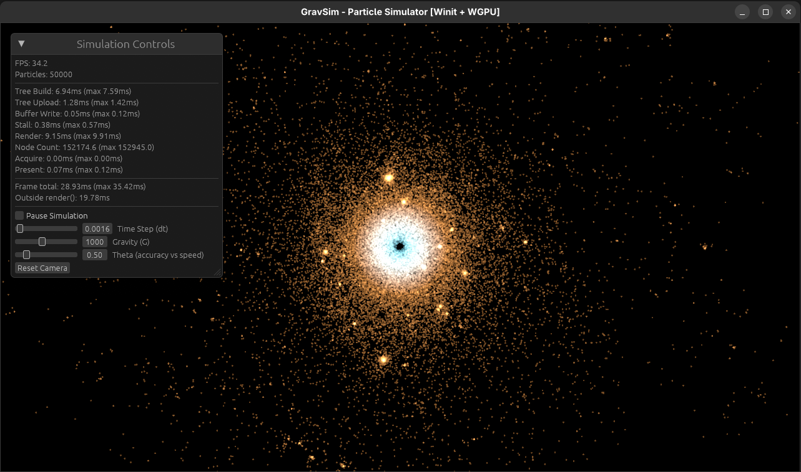

# Grav-Sim

A GPU-accelerated 2D gravitational N-body simulation written in Rust. It uses the Barnes-Hut algorithm on wgpu compute shaders and simulates a 100,000-body galaxy interactively.

<!-- TODO: replace with a clean screen recording converted to GIF -->




## What it does

Grav-Sim generates a disk galaxy with a massive central body and orbiting disk particles, then evolves it under mutual gravity in real time. Every particle attracts every other particle, so structure forms on its own: clumps, streams and clusters emerge from a nearly uniform starting disk.

A live control panel lets you change the gravitational constant, the time step and the Barnes-Hut accuracy threshold (θ) while the simulation runs. A built-in profiler shows where each frame's time goes.

## How it works

### Barnes-Hut instead of brute force

A direct N-body simulation computes every pair of interactions, which is O(N²): 10 billion force calculations per step at 100,000 bodies. Barnes-Hut groups distant particles into a quadtree and treats each distant group as a single mass at its centre of mass. That reduces the cost to O(N log N).

The θ parameter controls the trade-off. A tree node is approximated as one mass when `node_size / distance < θ`. Lower θ is more accurate; higher θ is faster.

### Per-frame pipeline

1. **Read back** the current particle positions from the GPU into a staging buffer.
2. **Build the quadtree on the CPU**, computing the total mass and centre of mass of every node, and flatten it into a GPU-friendly array (`GpuNode`, 48 bytes, explicitly padded for WGSL layout rules).
3. **Upload the tree** to a GPU storage buffer.
4. **Compute pass:** one thread per particle (workgroups of 256) traverses the tree with an explicit stack, since WGSL has no recursion, and accumulates acceleration from nodes that pass the θ test.
5. **Integrate** with semi-implicit (symplectic) Euler: velocity first, then position using the new velocity. A softening term in the distance prevents the force from blowing up when two particles get very close.
6. **Render** all particles in a single instanced draw call, colour-graded by distance from the galactic centre, followed by the egui panel. Stars use additive blending, so overlapping light accumulates and dense regions such as the core and clusters glow brighter than sparse ones. A minimum on-screen size keeps stars visible at any zoom level.

Particle state lives in two buffers used in a ping-pong arrangement: each frame reads from one and writes to the other, so no thread ever reads a position that another thread has already updated in the same step.

### Initial conditions

Disk particles are placed uniformly by area between a minimum and maximum radius and given circular orbital velocities around the central mass, plus a small random perturbation so the disk doesn't stay perfectly symmetric. The central body's velocity is set to cancel the disk's total momentum, so the galaxy as a whole doesn't drift off-screen.

## Performance

Measured on an **NVIDIA GeForce GTX 1650 Ti** (laptop, Vulkan backend), release build, 800×600 window, θ = 0.5, after letting each run settle for 60 seconds. Values are averages over the profiler's 60-frame window.

| Particles | FPS | Frame total | Tree build (CPU) | Tree upload | `render()` total (CPU) | Outside `render()` | Tree nodes |
|---:|---:|---:|---:|---:|---:|---:|---:|
| 10,000 | 143.7 | 6.94 ms | 1.39 ms | 0.25 ms | 2.23 ms | 4.72 ms | ~29,400 |
| 50,000 | 36.9 | 27.76 ms | 7.83 ms | 1.29 ms | 10.01 ms | 17.75 ms | ~151,500 |
| 100,000 | 15.0 | 67.73 ms | 19.04 ms | 2.53 ms | 22.85 ms | 44.88 ms | ~301,100 |

### Where the time goes

Almost all of the CPU work inside `render()` is the quadtree build. The largest cost, though, is the time outside `render()`, which grows with particle count. <!-- TODO: confirm with GPU timestamp queries, then state the measured GPU compute time here -->

The frame is effectively serial: the GPU has to finish before the CPU can read positions back, and the CPU has to finish the tree before the GPU can start the next step. Neither side works while the other does.

## Running it

Requires a Rust toolchain and a GPU supported by wgpu (Vulkan, Metal or DirectX 12).

```bash
git clone https://github.com/the-coderbee/Grav-Sim.git
cd Grav-Sim
cargo run --release -- --particles 50000
```

Always use `--release`; debug builds are dramatically slower.

### Controls

| Input | Action |
|---|---|
| Scroll | Zoom |
| Left-drag | Pan |
| **Reset Camera** button | Return to the default view |
| **Pause Simulation** checkbox | Freeze time (rendering continues) |
| Sliders | Time step (dt), gravity (G), θ |

## Limitations and next steps

- **Build the quadtree on the GPU.** This removes the per-frame readback and the CPU tree build, which are the main costs at high particle counts.
- **Overlap CPU and GPU work.** Building the tree from the previous frame's positions would let the CPU and GPU run in parallel, at the cost of one frame of latency in the tree.
- **Fixed traversal stack.** The compute shader uses a 64-entry stack with no overflow guard, which limits the maximum tree depth it can safely traverse.
- **2D only, single precision.** Positions use `f32`, which limits accuracy for very large or very long-running simulations.

## Built with

[wgpu](https://wgpu.rs/) · [winit](https://github.com/rust-windowing/winit) · [egui](https://github.com/emilk/egui) · [glam](https://github.com/bitshifter/glam-rs) · [bytemuck](https://github.com/Lokathor/bytemuck)
